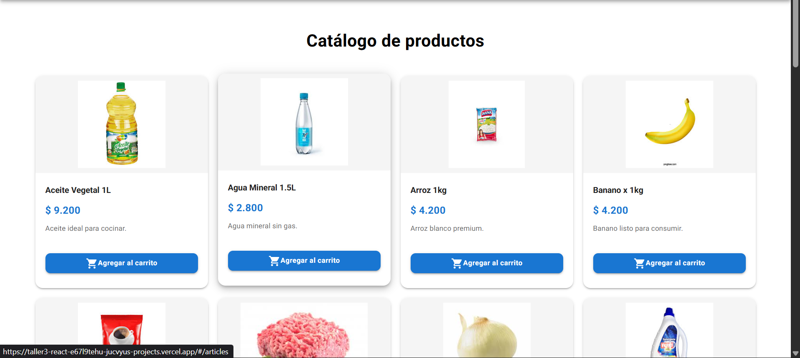
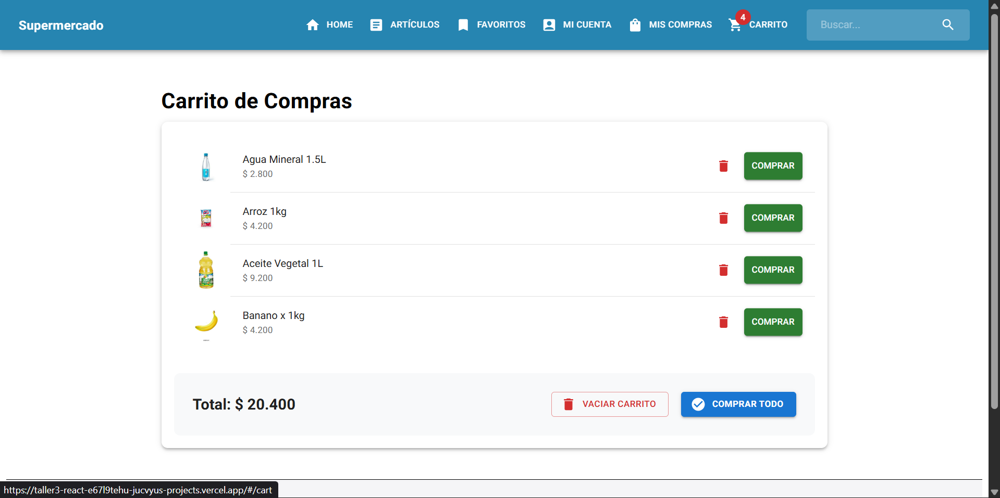
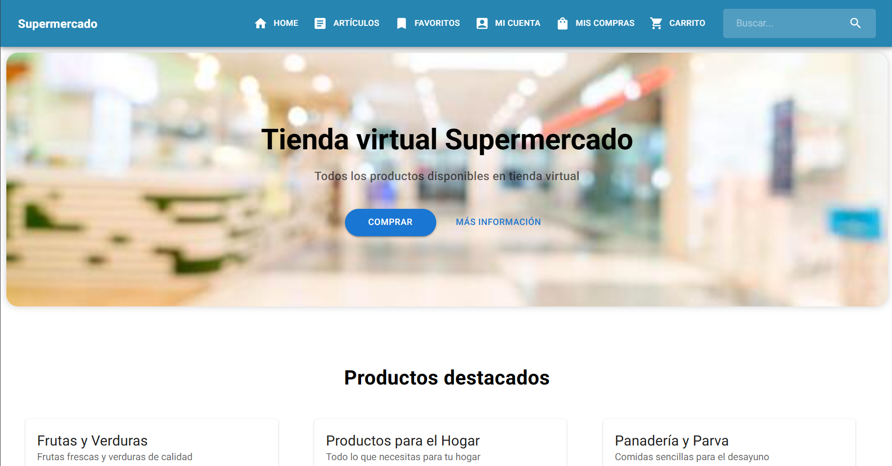
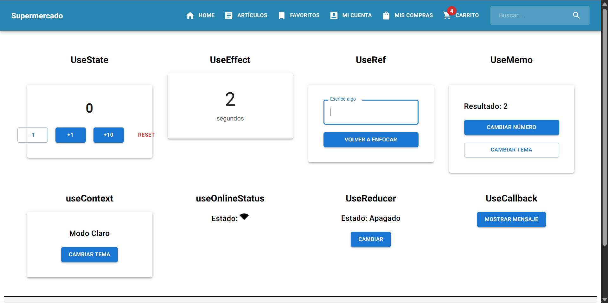
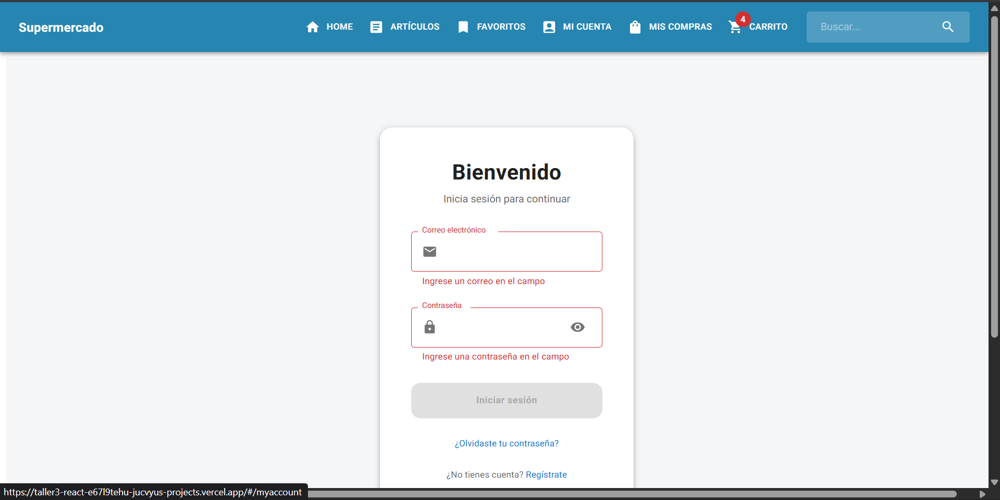

# React + Vite

This template provides a minimal setup to get React working in Vite with HMR and some ESLint rules.

Currently, two official plugins are available:

- [@vitejs/plugin-react](https://github.com/vitejs/vite-plugin-react/blob/main/packages/plugin-react) uses [Babel](https://babeljs.io/) (or [oxc](https://oxc.rs) when used in [rolldown-vite](https://vite.dev/guide/rolldown)) for Fast Refresh
- [@vitejs/plugin-react-swc](https://github.com/vitejs/vite-plugin-react/blob/main/packages/plugin-react-swc) uses [SWC](https://swc.rs/) for Fast Refresh

## React Compiler

The React Compiler is not enabled on this template because of its impact on dev & build performances. To add it, see [this documentation](https://react.dev/learn/react-compiler/installation).

## Expanding the ESLint configuration

If you are developing a production application, we recommend using TypeScript with type-aware lint rules enabled. Check out the [TS template](https://github.com/vitejs/vite/tree/main/packages/create-vite/template-react-ts) for information on how to integrate TypeScript and [`typescript-eslint`](https://typescript-eslint.io) in your project.


# 🛒 Supermercado Virtual - Taller React

Proyecto desarrollado para la asignatura **React**, enfocado en la simulación completa de un flujo de venta de un supermercado, aplicando gestión de estado global, hooks avanzados y diseño responsivo.

**🌐 Demo en Vivo:** [Ver Proyecto en Vercel](https://taller3-react-e67l9tehu-jucvyus-projects.vercel.app/#/)

---

## 📝 Descripción
Esta aplicación es una simulación de e-commerce que permite la navegación por un amplio catálogo de productos de consumo masivo. El proyecto integra el uso de **Hooks** fundamentales de React para el manejo de lógica de negocio y **Context API** para la persistencia del carrito de compras, asegurando una interfaz moderna, rápida y funcional.

## ✨ Características Principales
* **Gestión de Estado Global:** Implementación de un carrito sincronizado en tiempo real entre el catálogo y el Header mediante `Context API`.
* **Catálogo de Productos:** Galería dinámica que consume imágenes locales optimizadas almacenadas en el directorio público.
* **Hooks Especializados:** Práctica avanzada de hooks como `useContext`, `useEffect`, `useMemo`, `useCallback`, `useReducer`, `useState` y `useRef`.
* **Sistema de Carrito Completo:** * Agregar productos con actualización automática del Badge.
    * Eliminación selectiva de artículos y vaciado total del carrito.
    * Simulación de procesos de compra con feedback al usuario.
* **Navegación Modular:** Enrutamiento dinámico y protegido utilizando `react-router-dom`.
* **Interfaz de Alta Calidad:** Diseño basado en **Material UI (MUI)**, utilizando componentes como Cards, Buttons, ListItems y Layouts adaptativos.

## 🛠️ Tecnologías Utilizadas
* **Vite:** Herramienta de construcción de última generación.
* **React 18:** Biblioteca principal para la creación de interfaces.
* **Material UI (MUI):** Framework de diseño para componentes UI.
* **React Router Dom:** Gestión de navegación y rutas SPA.
* **Context API:** Manejo de estado global nativo de React.

## 🏗️ Arquitectura del Proyecto
El proyecto sigue una estructura profesional basada en **Features**, facilitando la mantenibilidad:

```text
t3_eshop/
 ├── public/                # Assets estáticos
 │    └── img/              # Banco de imágenes de productos (.jpg)
 ├── src/
 │    ├── features/
 │    │    ├── articles/    # Componentes de catálogo y hooks de lógica (useMemo, useCallback, etc.)
 │    │    └── auth/        # Módulo de usuario (Login, MyAccount, MyBuys, MyFavourite)
 │    ├── layout/           # Componentes de estructura global
 │    │    ├── components/  # Header, Footer, Content, BadgeCart
 │    │    └── hooks/       # Estado global del carrito (ContextCart.jsx)
 │    ├── shared/           # Carpeta de componentes compartidos (CSS)
 |    |      ├── CSS        # Estilos globales (App.css, index.css)
 │    ├── App.jsx           # Componente raíz y Providers
 │    ├── Routes.jsx        # Configuración centralizada de rutas
 │    └── main.jsx          # Punto de entrada de la aplicación
 └── package.json           # Dependencias y scripts del proyecto
```
## 👤 Datos del Autor
**Nombre:** Juan Andrés Isaza Loaiza

**Rol:** Estudiante Fullstack

**GitHub:** @Jucvyu

**LinkedIn:** [linkedin.com/in/tu-perfil](https://www.linkedin.com/in/juan-andres-isaza-loaiza-66b506369/)

**Asignatura:** React - Simulación de venta web

## 🖼️ Interfaz Gráfica

El diseño de la aplicación se centra en la claridad visual y la facilidad de navegación, utilizando una paleta de colores limpia y componentes de **Material UI** que garantizan una experiencia de usuario intuitiva.

| Catálogo de Productos | Gestión de Carrito | Landing Page | Favoritos | Mi cuenta |
| :---: | :---: | :---: | :---: | :---: |
|  |  |  |  | 

### Puntos Destacados del Diseño:
* **Cards Dinámicas:** Cada producto se presenta con su imagen, precio formateado y un botón de acción rápida.
* **Feedback Inmediato:** Uso de Badges en el Header para mostrar la cantidad de artículos sin cambiar de vista.
* **Resumen Detallado:** Una vista de carrito organizada con listas, avatares de productos y cálculos automáticos de totales.
* **Adaptabilidad:** La interfaz se ajusta automáticamente para ser utilizada cómodamente en dispositivos móviles (Responsive Design).

## ✨ Características Principales
Esta aplicación no es solo un catálogo visual; integra patrones de diseño y herramientas avanzadas de desarrollo para garantizar eficiencia y escalabilidad.

## 🛠️ Gestión de Estado y Lógica de Negocio
**Estado Global con Context API:** Implementación de un CartProvider que centraliza la lógica del carrito, permitiendo que cualquier componente de la aplicación acceda y modifique los artículos sin necesidad de prop drilling.

**Hooks de Rendimiento:** Uso estratégico de useMemo y useCallback para memorizar cálculos pesados (como el total de la compra) y funciones, evitando renderizados innecesarios y optimizando la fluidez de la interfaz.

**Hooks Personalizados:** Creación de hooks propios para desacoplar la lógica de los componentes visuales, facilitando el mantenimiento y la reutilización del código.

## 🛒 Experiencia de Usuario (UX)
Sincronización en Tiempo Real: Los cambios en el carrito se reflejan instantáneamente en el Badge del encabezado y en la vista de resumen, proporcionando feedback inmediato al usuario.

## Gestión Granular del Carrito: 

**Compra Individual:** Opción de procesar artículos uno por uno.

**Eliminación Selectiva:** Botones dedicados para quitar productos específicos con validación visual.

**Vaciado Masivo:** Función para limpiar el estado completo del carrito tras una compra exitosa o por decisión del usuario.

**Formateo de Moneda Dinámico:** Uso de toLocaleString para presentar precios en formato COP (Peso Colombiano) de manera automática y profesional.

## 🎨 Diseño y Estructura
**Sistema de Diseño MUI:** Interfaz construida sobre Material UI, aprovechando el sistema de Grids para una responsividad total y componentes de alta calidad como Avatars, Cards y Modals.

**Arquitectura basada en Features:** Organización de carpetas por funcionalidades (articles, auth, layout), siguiendo las mejores prácticas de la industria para proyectos escalables en React.

**Navegación SPA:** Transiciones suaves entre secciones (Catálogo, Cuenta, Carrito) mediante el uso de rutas dinámicas.
